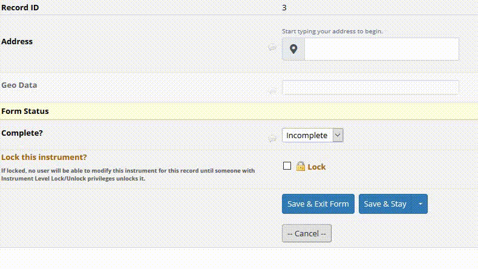

# Address Auto Complete
**Please note that currently supported countries are: Switzerland, United Kingdom.**

Redcap Module that helps you to easily create Auto-Complete Address fields that fetch results from APIs. Additionally, save geo data in custom variables and adjust the format of the address label.

## Setup

Install the module from REDCap module repository and enable over Control Center.

## Configuration

- API Source: Select the source from where the auto-complete list will be generated.
- API Response Limit: Defines how may results are returned per search request. This can significantly affect performance. Default and maximum are set to 20.
- API Key: An API key can be used to have higher priviliges, such as performing more requests per time. In general API keys are obtained by application.
- Enable for Data Entry or Enable for Survey: Define where the module will be rendered.
- Target Field: Select target field to be transformed into Address Auto-Complete.
- Enable advanced save: Define additional target fields for Street, Number, Post Code and City.
- Target Meta: Select meta field where geo information should be saved. Format is <code>address-id, x, y</code>.
- Custom output format: Use <i>%PLACEHOLDER%</i> to refer to address parts. <i>Default: <code>%STREET% %NO%, %CODE% %PLACE%</code></i>.
- Enable Custom Address: Adds the possibility to input custom addresses manually in case a search does not return any result.
- Enable Javascript Debug: Shows Log Messages in Javascript Console.

## Add your API source

*Requirements for APIs*

- Trustable
- Free/Affordable
- Compatible: The search endpoint should be accessbile through a GET-request and should return a JSON response.

If you want to add your own API, please make a Pull Request that includes the following edits:

- `/sources/sources.json`: Add the API details, such as identifier, url, endpoint, search term, etc.
- `/sources/your_api_source.php`: Add a mapping function, that maps your API response to the Address class of the module.
- `/config.json`: Add your api source as a name-value-pair under choices for the project setting `api-source`.
- `/sources/img/your.api.svg`: Optionally, add a logo of the API in svg format. 

In case the API is build in a way that secondary actions/requests are needed, you can additionaly include:
- `/js/secondary/your_api_source.js`: Add a function `STPH_addressAutoComplete.performSecondaryAction` that returns the address object as promise. The response object **must** contain  street, number, code, city, x (longtitude), y (latitude)
- Also do not forget to add `"secondary": true` to your `/sources/sources.json` for the relevant source, if you want the secondary action to be triggered.

If you cannot make the development yourself, but have found a useful API, please [open a Github Issue](https://github.com/tertek/redcap-address-auto-complete/issues) describing the details about the API source to be added.

## Available APIs

Identifier     | Country              | Limitation*    | Authentication |
-------------- | -------------------- | -------------- | -------------- |
geo.admin.ch   | Switzerland          | 20 / Minute    | no             |
getaddress.io  | United Kingdom       | 20 / Day       | yes            |

\* For free use.

## Roadmap

- Update docs for version 1.2.0
- Improve Source Validation before Module render.

## Changelog

Version | Description
------- | --------------------
v1.0.0  | Initial release.
v1.1.0  | New Features: Custom Addresses input, Advanced Save for address data in target fields
v1.2.0  | New API Source: United Kingdom - getaddress.io